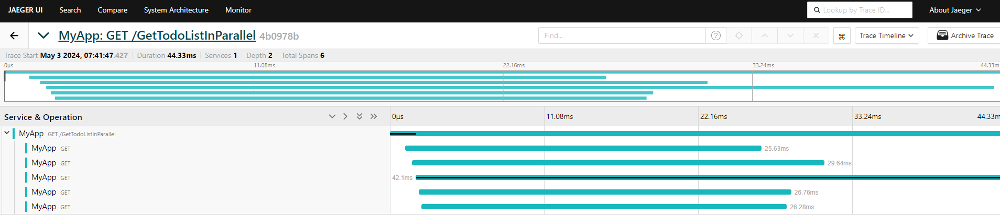
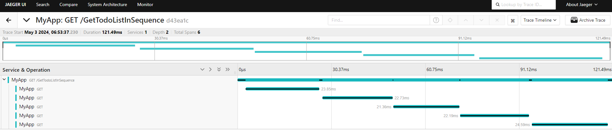

# Open Telemetry Tracing

Sample application which uses Open Telemetry for Tracing and displays the traces using Jaeger<br>
This application calls Todo List API to fetch Todo list Items


- [Open Telemetry Tracing](#open-telemetry-tracing)
  - [Endpoints](#endpoints)
    - [GetTodoList In Parallel](#gettodolist-in-parallel)
    - [GetTodoList In Sequence](#gettodolist-in-sequence)
  - [Register Open Telemetry services](#register-open-telemetry-services)
  - [Run Jaeger in Docker](#run-jaeger-in-docker)
  - [Add OTEL Exporter to environment variable in launch settings](#add-otel-exporter-to-environment-variable-in-launch-settings)


## Endpoints

### GetTodoList In Parallel
* Calls TodoList Api in parallel
* Demonstrate how traces look like when making http calls in Parallel



### GetTodoList In Sequence
* Calls TodoList Api in sequence
* Demonstrate how traces look like when making http calls one by one




## Register Open Telemetry services

```csharp
builder.Services
    .AddOpenTelemetry()
    .ConfigureResource(resource => resource.AddService("MyApp"))
    .WithTracing(tracing =>
    {
        tracing
            .AddAspNetCoreInstrumentation()
            .AddHttpClientInstrumentation();

        tracing.AddOtlpExporter(opt =>
        {
            opt.Endpoint = new Uri("http://localhost:4317");
        });
    });
```

## Run Jaeger in Docker
```bash
docker run -d -p 4317:4317 -p 16686:16686 jaegertracing/all-in-one:latest
```
Jaeger UI is available in port http://localhost/16686

## Add OTEL Exporter to environment variable in launch settings

```json
{
  "environmentVariables": {
    "ASPNETCORE_ENVIRONMENT": "Development",
    "OTEL_EXPORTER_OTLP_ENDPOINT": "http://localhost:4317"
  }
}
```
